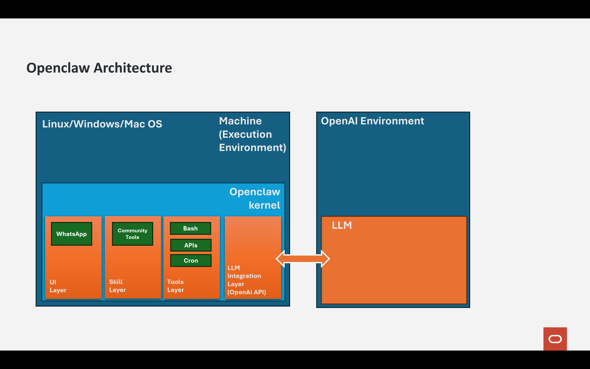
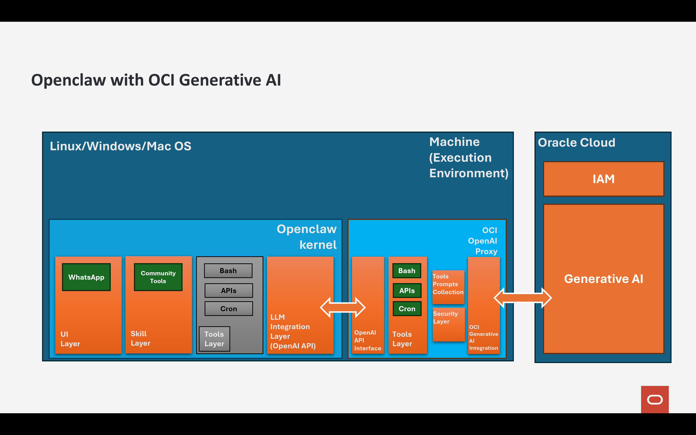
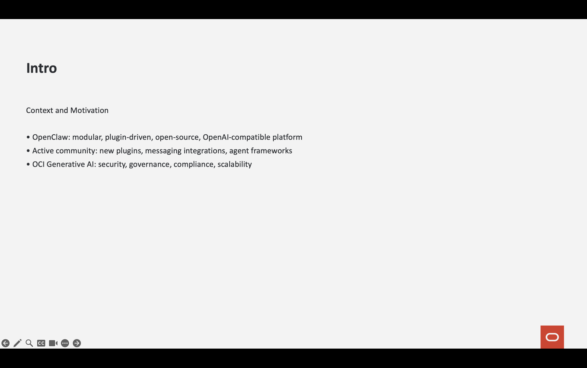
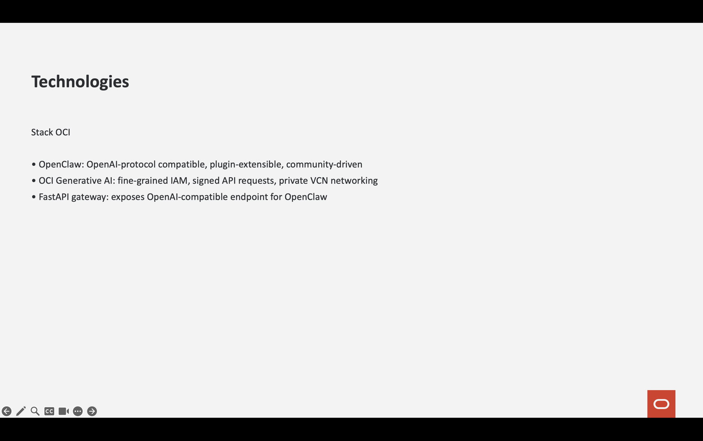
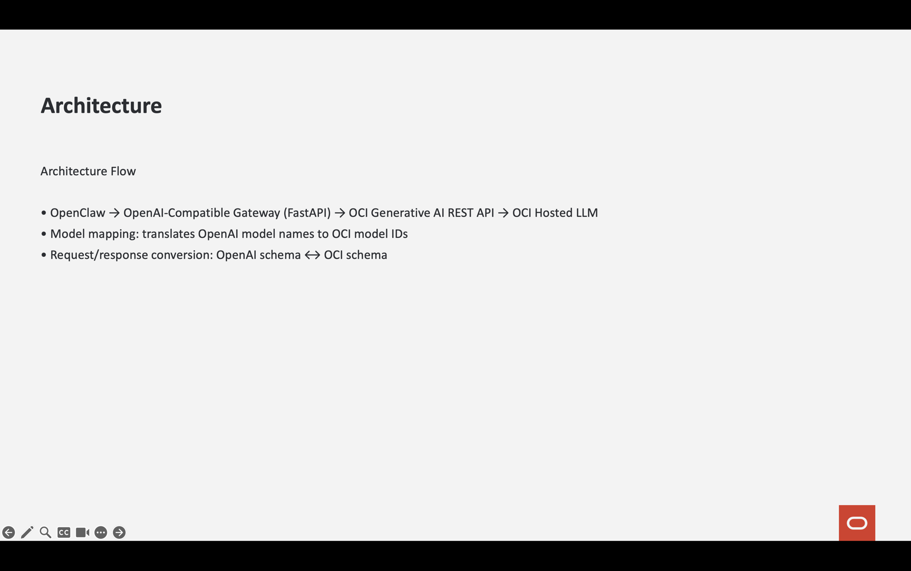
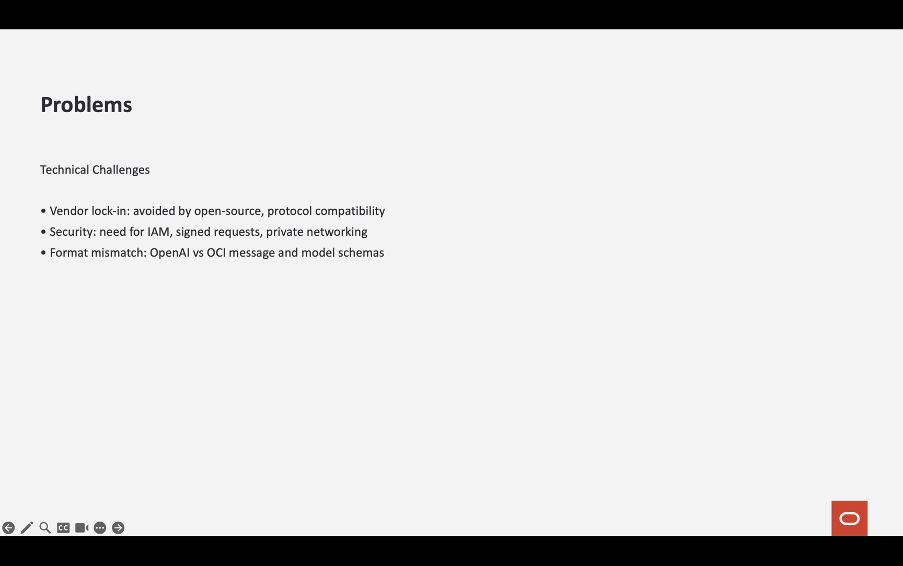
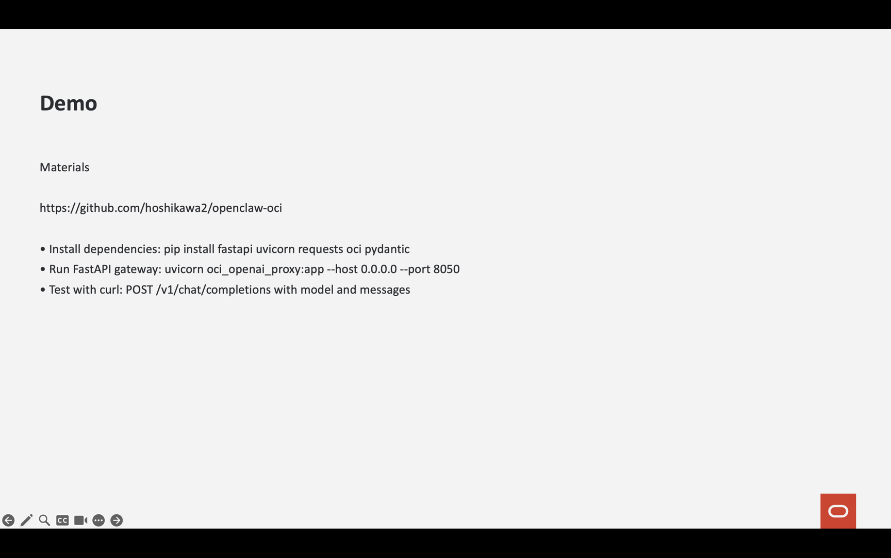
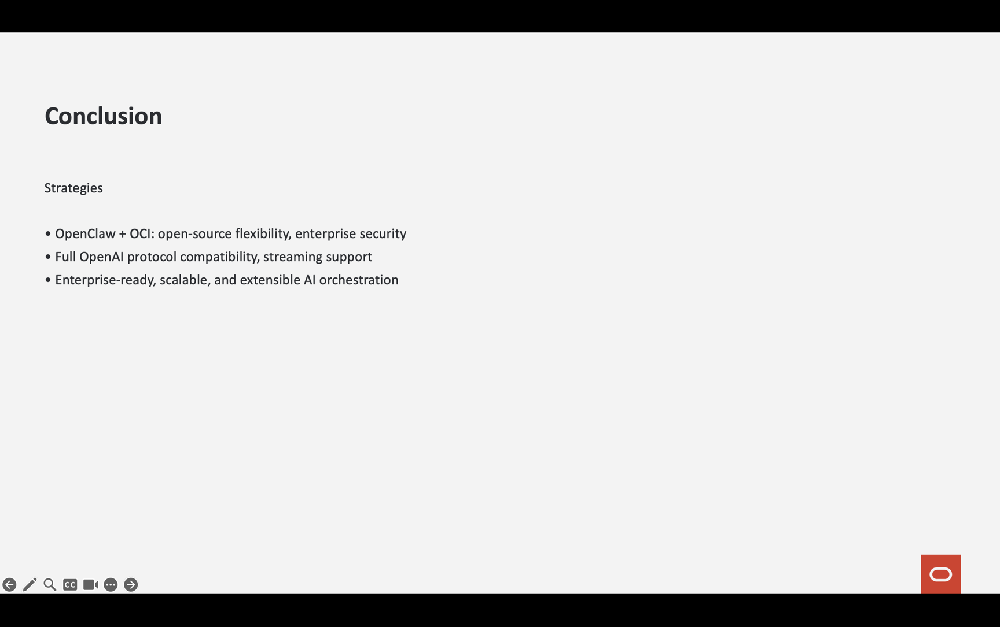

# Generate PowerPoint Presentations with OpenClaw and Oracle Cloud Generative AI 

## Enterprise AI Power, Open Ecosystem, Zero Compromise

The rapid evolution of AI orchestration tools has reshaped how companies build intelligent systems. Among these tools, OpenClaw has emerged as a powerful open-source platform designed to simplify the creation of AI agents, conversational workflows, and multi-channel integrations.

OpenClaw is not just another wrapper around LLM APIs. It is:

* Modular
* Plugin-driven
* Open-source
* OpenAI-compatible
* Community-powered

Its OpenAI-compatible design makes it instantly interoperable with the entire AI tooling ecosystem — SDKs, automation frameworks, browser clients, bots, and custom agent pipelines.

And because it is open source, innovation happens in public.

There is an active and growing community contributing:

* New plugins
* Messaging integrations (WhatsApp, web, etc.)
* Tool execution engines
* Agent frameworks
* Workflow automation patterns
* Performance optimizations

This means OpenClaw evolves continuously — without vendor lock-in.

But while agility and innovation are essential, enterprises require something more:
* Security
* Governance
* Compliance
* Regional data sovereignty
* Observability
* Controlled network exposure
* Predictable scalability

This is where Oracle Cloud Infrastructure (OCI) Generative AI becomes the strategic enterprise choice.

⸻

## The Power of Ecosystem + Enterprise Security

### OpenClaw: Open Ecosystem Advantage

Because OpenClaw is:
* Open-source
* Community-driven
* Plugin-extensible
* OpenAI-protocol compatible

You benefit from:

* Rapid innovation
* Transparent architecture
* Community-tested integrations
* Zero dependency on a single SaaS provider
* Full customization capability

You are not locked into one AI vendor.
You control your orchestration layer.

This flexibility is critical in a world where models evolve rapidly and enterprises need adaptability.

⸻

## OCI Generative AI: Enterprise Trust Layer

Oracle Cloud Infrastructure adds what large organizations require:
* Fine-grained IAM control
* Signed API requests (no exposed API keys)
* Dedicated compartments
* Private VCN networking
* Sovereign cloud regions
* Enterprise SLAs
* Monitoring & logging integration
* Production-ready inference endpoints

OCI Generative AI supports powerful production-grade models such as:
* Cohere Command
* LLaMA family
* Embedding models
* Custom enterprise deployments
* OpenAI-compatible models via mapping

This creates a secure AI backbone inside your own tenancy.

⸻

## Why This Combination Is Strategically Powerful

By implementing a local OpenAI-compatible gateway backed by OCI:

OpenClaw continues to behave exactly as designed —
while inference happens securely inside Oracle Cloud.

You gain:
* Full OpenAI protocol compatibility
* Enterprise security boundaries
* Cloud tenancy governance
* Scalable AI inference
* Ecosystem extensibility
* Open-source flexibility

Without rewriting your agents.
Without breaking plugins.
Without sacrificing innovation.

------------------------------------------------------------------------

# Why Use OCI Generative AI?

Oracle Cloud Infrastructure provides:

-   Enterprise security (IAM, compartments, VCN)
-   Flexible model serving (ON_DEMAND, Dedicated)
-   High scalability
-   Cost control
-   Regional deployment control
-   Native integration with Oracle ecosystem

By building an OpenAI-compatible proxy, we combine:

OpenClaw flexibility + OCI enterprise power

------------------------------------------------------------------------


# OpenClaw + OCI Generative AI Gateway **and** PPTX Template Builder


## About the tutorial


### OpenAI-compatible endpoint 

This tutorial is based on [Integrating OpenClaw with Oracle Cloud Generative AI (OCI)](https://github.com/hoshikawa2/openclaw-oci) tutorial and  explains how to integrate **OpenClaw** with **Oracle Cloud
Infrastructure (OCI) Generative AI** by building an OpenAI-compatible
API gateway using FastAPI.

Instead of modifying OpenClaw's core, we expose an **OpenAI-compatible
endpoint** (`/v1/chat/completions`) that internally routes requests to
OCI Generative AI.

This approach provides:

-   ✅ Full OpenClaw compatibility
-   ✅ Control over OCI model mapping
-   ✅ Support for streaming responses
-   ✅ Enterprise-grade OCI infrastructure
-   ✅ Secure request signing via OCI SDK

### Secure Enterprise Prompting

In this material, you have a prompt file that will be incorporate into the **OCI OpenAPI Proxy** (oci_openai_proxy.py). The prompt (pptx_runner_policy_strict.txt) was created to generate a automatic PowerPoint presentation based on any web documentation (github, docs.oracle.com). This example demonstrates a more enterprise secure way to use the OCI IAM to control the cloud resources like Object Storage and LLM.

See the prompt that is incorporated in the OCI OpenAI Proxy:

```
Whenever the user requests PPTX generation with external material (link, file, or text):

----------------------------------------------
STEP 0 – FIXED WORKING DIRECTORY (MANDATORY)
----------------------------------------------

All operations MUST occur inside:
    $HOME/.openclaw/workspace/openclaw_folder

Execute:
    cd $HOME/.openclaw/workspace/openclaw_folder

----------------------------------------------
STEP 1 – PREPARATION (MANDATORY)
----------------------------------------------

The file generate_openclaw_ppt_template.py is located in $HOME/.openclaw/workspace/openclaw_folder
The file read_url is located in $HOME/.openclaw/workspace/openclaw_folder
The file read_file is located in $HOME/.openclaw/workspace/openclaw_folder

Required:

    read_url for links
    read_file for local files

GITHUB LINK HANDLING (REQUIRED)

    If the link contains:
    github.com/.../blob/...
    Automatically convert to:
    raw.githubusercontent.com/USER/REPO/BRANCH/PATH
    BEFORE calling read_url.

    Example:
    Original:
    https://github.com/user/repo/blob/main/app.py
    Convert to:
    https://raw.githubusercontent.com/user/repo/main/app.py
    Then call:
    read_url <raw_url>

    If the returned content contains <html or <script>, extract only visible text, removing HTML tags.

    * If the content cannot be read successfully → ABORT.

MANDATORY PIPELINE:

    1) Save material to file:
        (exec read_url <url> > $HOME/.openclaw/workspace/openclaw_folder/material_raw.txt)

    2) Analyze material_raw.txt and generate content.json explicitly:
        (exec cat > $HOME/.openclaw/workspace/openclaw_folder/content.json << 'EOF'
        <valid JSON only>
        EOF)

        Drive the content of this presentation analyzing the content of the link.

        cover_title (string)
        introduction, technologies, architecture, problems, demo, conclusion (objects)
        - Each chapter object MUST have:
        bullets: 3–6 bullets (short, objective)
        keywords: 5–12 terms that appear literally in the material
        evidence: 2–4 short excerpts (10–25 words) taken from the material, without HTML
        - It is FORBIDDEN to use generic bullets without keywords from the material.
        - VALIDATION: if it is not possible to extract at least 20 unique keywords from the total material → ABORT.

    3) Validate JSON:
        (exec python -m json.tool $HOME/.openclaw/workspace/openclaw_folder/content.json)

        Only after successful validation:
        (exec export OCI_LINK_DEMO="<url>")
        (exec python generate_openclaw_ppt_template.py)

----------------------------------------------
STEP 2 – MODIFICATION VALIDATION [STRICT VERSION]
----------------------------------------------

Before running:

    - Verify that each chapter contains at least 1 literal keyword from the material.
    - Verify that at least 8 keywords appear in 4 or more slides.
    - Verify that each chapter contains at least 1 piece of evidence.
    If it fails → ABORT.

----------------------------------------------
STEP 3 – EXECUTION
----------------------------------------------

Only now execute:

    SET THE ENVIRONMENT VARIABLE WITH THE URL PASSED AS A BASIS FOR DOCUMENTATION AND THE FILE NAME GENERATED WITH CONTENT READ FROM THE LINK:

    `export OCI_LINK_DEMO=<link passed as documentation>`
    `export OCI_CONTENT_FILE=<NAME OF THE GENERATED FILE>`
    `python $HOME/.openclaw/workspace/openclaw_folder/generate_openclaw_ppt_template.py`

----------------------------------------------
STEP 4 – UPLOAD
----------------------------------------------

    First, delete the file in object storage: `openclaw_oci_presentation.pptx`

    And only then upload it to Object Storage: `oci os object put \
    --bucket-name hoshikawa_template \
    --file` $HOME/.openclaw/workspace/openclaw_folder/openclaw_oci_presentation.pptx \
    --force

----------------------------------------------
STEP 5 – GENERATE PRE-AUTH LINK
----------------------------------------------
    oci os preauth-request create ...

```

The custom prompt is incorporated here:

```
PROMPT_PATH = os.path.expanduser("pptx_runner_policy_strict.txt")
def load_runner_policy():
    if os.path.exists(PROMPT_PATH):
        with open(PROMPT_PATH, "r", encoding="utf-8") as f:
            return f.read()
    return ""
RUNNER_POLICY = load_runner_policy()

RUNNER_PROMPT = (
        RUNNER_POLICY + "\n\n"
                        "You are a Linux execution agent.\n"
                        "\n"
                        "OUTPUT CONTRACT (MANDATORY):\n"
                        "- You must output EXACTLY ONE of the following per response:\n"
                        "  A) (exec <command>)\n"
                        "  B) (done <final answer>)\n"
                        "\n"
                        "STRICT RULES:\n"
                        "1) NEVER output raw commands without (exec <command>). Raw commands will be ignored.\n"
                        "2) NEVER output explanations, markdown, code fences, bullets, or extra text.\n"
                        "3) If you need to create multi-line files, you MUST use heredoc inside (exec <command>), e.g.:\n"
                        "   (exec cat > file.py << 'EOF'\n"
                        "   ...\n"
                        "   EOF)\n"
                        "4) If the previous tool result shows an error, your NEXT response must be (exec <command>) to fix it.\n"
                        "5) When the artifact is created successfully, end with (done ...).\n"
                        "\n"
                        "REMINDER: Your response must be only a single parenthesized block."
)

```

### PPTX Builder

**A PPTX builder** will generate a professional **PowerPoint deck from a template** (`.pptx`) + a structured `content.json`

The goal is to keep **OpenClaw** fully compatible with the OpenAI protocol while moving inference to **OCI** and enabling **artifact generation (PPTX)** using a repeatable, governed pipeline.

---

## Architecture

```
OpenClaw
  ↓ (OpenAI protocol)
OpenAI-compatible Gateway (FastAPI)
  ↓ (signed OCI REST)
OCI Generative AI (chat endpoint)
  ↓
LLM response

(Optional)
Material (URL / file / text)
  ↓
content.json (validated / governed)
  ↓
PPTX Builder (template + content.json)
  ↓
openclaw_oci_presentation.pptx
```

---

## Project structure

```
project/
 ├── oci_openai_proxy.py                 # FastAPI OpenAI-compatible gateway -> OCI GenAI
 ├── pptx_runner_policy_strict.txt       # Strict policy for extracting/validating material -> content.json
 ├── openclaw.json                       # Example OpenClaw config using the gateway
 └── README.md
 AND these files:
 ├── generate_openclaw_ppt_template.py   # PPTX generator (template + content.json)
 ├── read_url_and_read_file.sh           # Helper script to create read_url/read_file in OpenClaw workspace
 └── template_openclaw_oci_clean.pptx    # You MUST have one template here

 
 Move these files to:
 $HOME/.openclaw/workspace/openclaw_folder
 ├── generate_openclaw_ppt_template.py   # PPTX generator (template + content.json)
 ├── read_url_and_read_file.sh           # Helper script to create read_url/read_file in OpenClaw workspace
 └── template_openclaw_oci_clean.pptx    # You MUST have one template here
```

---

# Part A — OpenAI-compatible Gateway (OpenClaw → OCI GenAI)

## Why OCI Generative AI?

OCI provides what enterprises usually need:

- IAM & compartments
- Signed requests (no API key leakage)
- Regional control / sovereignty
- VCN options
- Observability integration
- Production-grade inference endpoints

By putting an OpenAI-compatible API in front of OCI, you get:

- ✅ OpenClaw compatibility
- ✅ Model mapping (OpenAI names → OCI modelIds)
- ✅ Streaming compatibility (simulated if OCI returns full text)
- ✅ Governance inside your tenancy





---

## Requirements

- Python 3.10+ (recommended)
- OCI config file (`~/.oci/config`) + API key
- Network access to OCI GenAI endpoint

Install dependencies:

```bash

pip install fastapi uvicorn requests oci pydantic
```

---

## Configuration (environment variables)

The gateway reads OCI configuration using environment variables (defaults shown):

```bash

export OCI_CONFIG_FILE="$HOME/.oci/config"
export OCI_PROFILE="DEFAULT"
export OCI_COMPARTMENT_ID="ocid1.compartment.oc1..."
export OCI_GENAI_ENDPOINT="https://inference.generativeai.<region>.oci.oraclecloud.com"
```

---

## Run the server

```bash

uvicorn oci_openai_proxy:app --host 0.0.0.0 --port 8050
```

---

## Test with curl

```bash

curl http://127.0.0.1:8050/v1/chat/completions   -H "Content-Type: application/json"   -d '{
    "model": "gpt-5",
    "messages": [{"role": "user", "content": "Hello"}]
  }'
  
```

Or if you want to generate a PPTX direct by the **oci_openai_proxy.py**:

```bash

curl http://127.0.0.1:8050/v1/chat/completions \
  -H "Content-Type: application/json" \
  -d '{
        "model": "gpt-5",
        "messages": [
            {"role": "user", "content": "generate pptx from https://github.com/hoshikawa2/flexcube-14.5 in portuguese"}
        ],
        "temperature": 0.2
      }'


```

---

## OpenClaw configuration (openclaw.json)

Point OpenClaw to the gateway:

- `baseUrl` → your local gateway (port 8050)
- `api` → **openai-completions**
- `model id` → must match a `MODEL_MAP` key inside `oci_openai_proxy.py`

Example provider block:

```json
{
  "models": {
    "providers": {
      "openai-compatible": {
        "baseUrl": "http://127.0.0.1:8050/v1",
        "apiKey": "sk-test",
        "api": "openai-completions"
      }
    }
  }
}
```

---

# Part B — PPTX generation from a template (Template → Deck)

## What it does

`generate_openclaw_ppt_template.py` builds a **fixed 7-slide** strategic deck:

1. Cover
2. Intro (use case)
3. Technologies
4. Architecture
5. Problems
6. Demo (includes the source link)
7. Conclusion

The deck is generated from:

- a **PPTX template** (with expected layouts),
- a `content.json` file,
- and a `OCI_LINK_DEMO` link (material source shown on the Demo slide).

---

## Inputs

### 1) PPTX template

You MUST have a PowerPoint template named **template_openclaw_oci_clean.pptx** with some master layout slides.

Default expected layout names inside the template:

- `Cover 1 - Full Image`
- `Full Page - Light`

You can change the template by passing `--template` or `PPTX_TEMPLATE_PATH`.

### 2) content.json

`content.json` must contain:

- `cover_title` (string)
- `introduction`, `technologies`, `architecture`, `problems`, `demo`, `conclusion` (objects)

Each section object must include:

- `bullets`: 3–6 short bullets
- `keywords`: 5–12 keywords that appear literally in the material
- `evidence`: 2–4 short excerpts (10–25 words) extracted from the material (no HTML)

The strict validation rules are described in `pptx_runner_policy_strict.txt`.

---

## Configure paths

Create a folder named **openclaw_folder** inside the $HOME/.openclaw/workspace.

``` bash

cd $HOME/.openclaw
mkdir openclaw_folder
cd openclaw_folder
```

Put these files into the openclaw_folder:

````
generate_openclaw_ppt_template.py
read_url_and_read_file.sh 
template_openclaw_oci_clean.pptx (Your PPTX template if you have)
````

Run this command only one time:
```
bash read_url_and_read_file.sh
```
This will generate the read_url and read_file tools.


You can run everything **without hardcoded paths** using either CLI flags or environment variables.

### Environment variables

```bash
# Optional: where your files live (default: current directory)
export OPENCLAW_WORKDIR="$HOME/.openclaw/workspace/openclaw_folder"

# Template + output
export PPTX_TEMPLATE_PATH="$OPENCLAW_WORKDIR/template_openclaw_oci_clean.pptx"
export PPTX_OUTPUT_PATH="$OPENCLAW_WORKDIR/openclaw_oci_presentation.pptx"

# Content JSON (if not set, defaults to $OPENCLAW_WORKDIR/content.json)
export OCI_CONTENT_FILE="$OPENCLAW_WORKDIR/content.json"

# Source link shown on the Demo slide
export OCI_LINK_DEMO="https://docs.oracle.com/en-us/iaas/Content/generative-ai/home.htm"
```

### CLI usage

```bash
python generate_openclaw_ppt_template.py   --template "$PPTX_TEMPLATE_PATH"   --output "$PPTX_OUTPUT_PATH"   --content "$OCI_CONTENT_FILE"   --link "$OCI_LINK_DEMO"
```

---

## End-to-end pipeline (URL → content.json → PPTX)

A typical (strict) flow:

1) **Read material** (URL or local file)  
2) **Generate `content.json`** following the strict policy  
3) **Validate JSON**  
4) **Generate PPTX**

### Helper scripts (read_url / read_file)

The repository includes `read_url e read_file.sh` to install helper scripts into your OpenClaw workspace.

Example:

```bash
bash "read_url e read_file.sh"
```

Then:

```bash
# Read URL
~/.openclaw/workspace/openclaw_folder/read_url "https://example.com" > material_raw.txt

# Read local file
~/.openclaw/workspace/openclaw_folder/read_file "/path/to/file.pdf" > material_raw.txt
```

### Validate JSON

```bash
python -m json.tool "$OCI_CONTENT_FILE" >/dev/null
```

### Generate PPTX

```bash
python gera_oci_ppt_openclaw_template.py --link "$OCI_LINK_DEMO"
```

---

## Deploying (common options)

### Option 1 — Run locally (developer laptop)

- Run the gateway with `uvicorn`
- Generate decks on demand in the workspace folder

### Option 2 — Server VM (systemd for gateway)

Create a systemd service (example):

```ini
[Unit]
Description=OpenAI-compatible OCI GenAI Gateway
After=network.target

[Service]
WorkingDirectory=/opt/openclaw-oci
Environment=OCI_CONFIG_FILE=/home/ubuntu/.oci/config
Environment=OCI_PROFILE=DEFAULT
Environment=OCI_COMPARTMENT_ID=ocid1.compartment...
Environment=OCI_GENAI_ENDPOINT=https://inference.generativeai.<region>.oci.oraclecloud.com
ExecStart=/usr/bin/python -m uvicorn oci_openai_proxy:app --host 0.0.0.0 --port 8050
Restart=always

[Install]
WantedBy=multi-user.target
```

### Option 3 — Containerize

- Put `oci_openai_proxy.py` inside an image
- Mount `~/.oci/config` read-only
- Pass the same env vars above

(Exact Dockerfile depends on how you manage OCI config and keys in your environment.)

---

## Troubleshooting

### PPTX builder errors

- **Layout not found**: your template does not have the expected layout names.
- **Too few placeholders**: your selected layout must have at least 2 text placeholders.
- **Exactly 7 slides**: the generator enforces the fixed structure.

### Content issues

- If `content.json` has generic bullets/keywords not present in the material, the strict policy should fail validation.
- If you cannot extract enough literal keywords, re-check your material extraction (HTML removal, raw GitHub URL, etc.).

---

## Test the Solution

Go to the openclaw dashboard:

```
openclaw dashboard
```


Try this:

```
generate a pptx based on this material https://github.com/hoshikawa2/openclaw-oci
```


And you get a temporary OCI Object Storage link:


This is the oci_openai_proxy.py monitoring output:


And the Presentation generated is:














---

# Final Notes

You now have:

✔ OpenClaw fully integrated\
✔ OCI Generative AI backend\
✔ Streaming compatibility\
✔ Enterprise-ready architecture

------------------------------------------------------------------------

# Reference

- [Integrating OpenClaw with Oracle Cloud Generative AI (OCI)](https://github.com/hoshikawa2/openclaw-oci)
- [Installing the OCI CLI](https://docs.oracle.com/en-us/iaas/private-cloud-appliance/pca/installing-the-oci-cli.htm)
- [Oracle Cloud Generative AI](https://www.oracle.com/artificial-intelligence/generative-ai/generative-ai-service/)
- [OpenClaw](https://openclaw.ai/)

# Acknowledgments

- **Author** - Cristiano Hoshikawa (Oracle LAD A-Team Solution Engineer)
